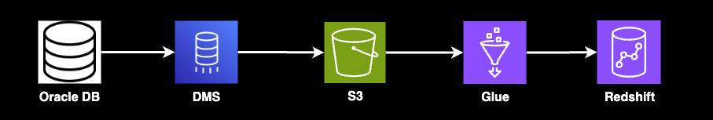
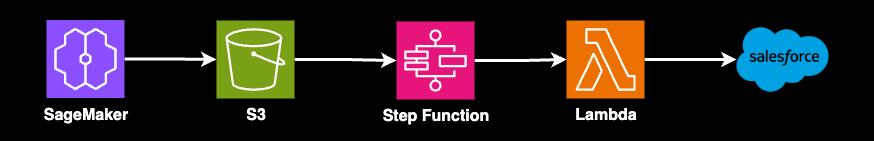

# Automated AWS Data Pipeline and Machine Learning Platform

> [!IMPORTANT]
> **Security Warning**
>
> The files `config/database/oracle-connection.json` and all `.tfvars` files within the `terraform/environments/` directory are provided as **examples only**.
>
> **DO NOT** commit these files with real credentials or sensitive information to a public repository. It is strongly recommended to add them to your `.gitignore` file to prevent accidental exposure.


This project aims to build a comprehensive, automated, and scalable cloud data platform. Its core objective is to integrate customer data from various sources (CSV files from CRM systems and Oracle databases), perform user segmentation through machine learning, and synchronize the results to Salesforce to support precision marketing campaigns.

This platform adopts AWS best practices, achieving end-to-end automation from data ingestion, processing, and monitoring to deployment through Infrastructure as Code (IaC) and CI/CD processes.

## ✨ Key Features

*   **Automated Data Ingestion and ETL**:
    *   Automatically listens for CSV files in S3, triggering Lambda and Glue for processing and loading into Redshift.
    *   Continuously migrates the Oracle database to Redshift using AWS DMS.

*   **Dynamic Schema Evolution**:
    *   The data pipeline can automatically detect new columns in the source data and update the Redshift table structure accordingly without manual intervention.

*   **ML-Powered User Segmentation**:
    *   Utilizes Amazon SageMaker to train and deploy machine learning models for user segmentation on the integrated data.

*   **End-to-End Salesforce Integration**:
    *   Orchestrated by Step Functions, the analysis results from SageMaker are automatically synchronized back to Salesforce, closing the business loop.

*   **Robust Monitoring and Data Quality Assurance**:
    *   Includes built-in data quality check rules and proactively sends alerts via SNS when anomalies are detected.
    *   Provides a centralized CloudWatch Dashboard for monitoring all pipeline statuses, supporting one-click retries for failed jobs.

*   **Security and Cost-Effectiveness**:
    *   All credentials are securely managed through AWS Secrets Manager.
    *   All cloud resources are uniformly deployed and managed via IaC (Terraform), and S3 lifecycle rules are used to automatically archive and delete old data to optimize costs.

*   **CI/CD and Code Review**:
    *   Integrates with GitHub Actions to automatically run `terraform plan` before code merges and requires code review to ensure the stability of the production environment.

## 📋 Table of Contents
1. [Deployment Steps](#-deployment-steps)
2. [CSV to Redshift](#-csv-to-redshift)
3. [Oracle to Redshift](#️-oracle-to-redshift)
4. [Redshift > SageMaker](#-redshift--sagemaker)
5. [Data Quality (S3 > Glue > SNS)](#-data-quality-s3--glue--sns)
6. [Salesforce Integration](#-salesforce-integration)
7. [Monitoring](#-monitoring)


## 🚀 Deployment Steps

To deploy this project, follow these steps:

1.  **Clone the Repository**:
    ```bash
    git clone <YOUR_GITHUB_REPOSITORY_URL>
    cd aws-data-pipeline
    ```

2.  **Configure GitHub Secrets**: In your GitHub repository, navigate to `Settings` -> `Secrets and variables` -> `Actions` -> `New repository secret`. You need to add the following secrets:

| Secret | Description |
| --- | --- |
| `AWS_ACCESS_KEY_ID` | Your AWS Access Key ID |
| `AWS_SECRET_ACCESS_KEY` | Your AWS Secret Access Key |
| `ORACLE_DB_HOST` | Oracle database hostname |
| `ORACLE_DB_PORT` | Oracle database port |
| `ORACLE_DB_SERVICE_NAME` | Oracle database service name |
| `ORACLE_DB_USER` | Oracle database username |
| `ORACLE_DB_PASSWORD` | Oracle database password |
| `SALESFORCE_CLIENT_ID` | Client ID of your Salesforce App |
| `SALESFORCE_CLIENT_SECRET` | Client Secret of your Salesforce App |
| `SALESFORCE_USERNAME` | Salesforce login username |
| `SALESFORCE_PASSWORD` | Salesforce login password |
| `SALESFORCE_SECURITY_TOKEN` | Salesforce security token |

3.  **Configure Terraform Backend**: An S3 backend is pre-configured in `terraform/main.tf` to store the Terraform state.
    ```terraform
    terraform {
      backend "s3" {
        bucket         = "my-terraform-state-bucket-unique-name" # Replace with a unique S3 bucket name
        key            = "aws-data-pipeline/terraform.tfstate"
        region         = "us-east-1" # Replace with your AWS region
        encrypt        = true
        dynamodb_table = "terraform-lock-table" # Ensure this DynamoDB table exists with a Primary Key 'LockID'
      }
    }
    ```
    > **Note**: Before the first Terraform run, you must manually create the S3 bucket and the DynamoDB table (for state locking). Ensure the S3 bucket name is globally unique.

4.  **Update Terraform Variable Files**: Check the `dev.tfvars`, `staging.tfvars`, and `prod.tfvars` files under the `terraform/environments/` directory. Update the variable values according to your environment's needs.

5.  **Push to GitHub to Trigger CI/CD**: Once you have configured the GitHub Secrets and updated the `tfvars` files, push your code to the `main` or `develop` branch of your repository:
    ```bash
    git add .
    git commit -m "Initial project setup and CI/CD configuration"
    git push origin main # or develop
    ```
    This will trigger the `ci-cd.yml` workflow, which automatically deploys your AWS infrastructure and code.

### Key Considerations and Next Steps

1.  **Placeholder Replacement**:
    - In `ci-cd.yml`, be sure to replace `s3://your-lambda-code-bucket/` and `s3://your-glue-scripts-bucket/` with your actual S3 bucket names.
    - Review all Terraform files and replace any placeholders marked with `NOTE:` or `TODO:`.
2.  **IAM Permission Refinement**:
    - We have configured permissions for Lambda, Glue, and DMS to access Secrets Manager. Be sure to review all IAM policies and refine them according to the principle of least privilege.
3.  **Python Code Implementation**:
    - The actual business logic needs to be implemented in the respective Lambda and Glue Python scripts.
4.  **SageMaker Model Development**:
    - The notebooks in `sagemaker/notebooks/` need to be developed to train the actual machine learning models.
5.  **Step Functions Definition**:
    - The JSON files in `step-functions/` need to be designed and implemented according to your business logic.
6.  **Monitoring and Alerts**:
    - The CloudWatch Dashboard in `monitoring/cloudwatch/dashboards/main-dashboard.json` needs to be customized to your needs.
    - Ensure the SNS alert email (`alert_email`) is configured correctly.

## 📄 CSV to Redshift


1.  When a CSV file is uploaded to the S3 bucket defined in `terraform/modules/s3/main.tf`, an event notification is configured via the `aws_s3_bucket_notification` resource.
2.  The S3 event notification triggers the `lambda_handler` function in `lambda_function.py`. Its sole job is to read the file path from the event and then call `glue.start_job_run()` to start a Glue job. It does not read the content of the CSV file at all.
3.  The `csv-to-redshift.py` script is where the CSV content is actually read and processed. Executed by the Glue service, it receives the file path from Lambda and uses Spark's capabilities to read the full content of the CSV file from S3, performing data transformation and column mapping.
4.  After processing the data, the same Glue script calls `glueContext.write_dynamic_frame` to connect to the Redshift cluster defined in `terraform/modules/redshift/main.tf` and writes the data in batches to the specified table.

> ### Summary
>
> - **Lambda (`lambda_function.py`)**: Acts as a **dispatcher**. Upon receiving a call (S3 notification), it finds the right entity (Glue job) to handle the task and tells it where to get the data (S3 path). The dispatcher itself does not process data.
> - **Glue (`csv-to-redshift.py`)**: Acts as a **data processing center**. Upon receiving the notification from the dispatcher, it sends out a fleet of workers (Spark workers) to fetch the goods (CSV file) from S3, processes them in its own factory, and finally delivers the finished product to the Redshift warehouse.
> - **Auto-Archiving**: Any new data uploaded to `csv_bucket_name` is automatically transitioned from "S3 Standard" to the more cost-effective **S3 Glacier Instant Retrieval** storage class after **30 days**.
> - **Auto-Deletion**: This data is automatically and permanently deleted after **730 days (two years)**.

### Error Handling Mechanism during Data Transfer

1.  **Glue Job Script**:
    - If any error occurs during the processing of a CSV file (e.g., data format mismatch, unable to write to Redshift), the script will:
        1.  Catch the error.
        2.  Move the original CSV file causing the error to the `error/` directory within the same S3 bucket.
        3.  Terminate the job and mark its status as `FAILED`.
    - **"Upsert" Logic Implemented**: The script first loads data into a temporary staging table. Then, based on a specified primary key (defaulted to `user_id`), it deletes old records in Redshift before inserting the new ones.
    - **"Auto-Add Column" Logic Implemented**: Before loading data, the script compares the columns of the CSV file with the existing columns in the Redshift table. If new columns are found in the CSV, it automatically executes an `ALTER TABLE ... ADD COLUMN ...` command.
2.  **Failure Alert Rule Added**:
    - A CloudWatch Event rule specifically monitors for `FAILED`, `TIMEOUT`, or `STOPPED` states of the Glue job.
    - When a job fails, this rule directly sends a notification to your configured SNS topic.

## 🗄️ Oracle to Redshift


1.  **Secrets Manager**: For security, sensitive information like database credentials is pre-stored in AWS Secrets Manager via the Terraform setup in `terraform/modules/secrets-manager/main.tf`.
2.  **Connection Config**: `config/database/oracle-connection.json` is intended to store non-sensitive connection settings for the Oracle database.
3.  **AWS SCT**: The AWS Schema Conversion Tool is used to analyze and convert the Oracle schema to a Redshift-compatible format.
4.  **AWS DMS**: The AWS Database Migration Service handles the actual data migration. It can perform a one-time Full Load or continuous data replication (Change Data Capture - CDC).
5.  **S3 Staging Area**: DMS does not write data directly to Redshift. Instead, it first places the data in an S3 staging area.
6.  **Glue Job**: Once DMS writes the data files to S3, it triggers a Glue job that ultimately writes the data to Redshift.

### How to Manage and Configure Sensitive Information (Secrets Manager)

> The correct workflow is to manually create a Secret in the AWS Console, and then reference it in Terraform by its name (ARN). The Terraform code itself should not contain any passwords.

### Complete Steps to Convert Schema from Oracle using AWS SCT

**Prerequisites**

1.  **Network Access**: Ensure the machine running SCT can connect to both your Oracle database and your AWS Redshift cluster.
2.  **Database Credentials**: Have all connection information ready for both Oracle and Redshift.
3.  **Download AWS SCT**: Download and install it from the [official download page](https://aws.amazon.com/dms/schema-conversion-tool/).
4.  **Download JDBC Drivers**: SCT requires JDBC drivers (`.jar` files) for both Oracle and Redshift.

---

**Operating Steps**

1.  **Configure SCT Drivers**: Set the driver paths in `Settings` > `Global Settings` > `Drivers`.
2.  **Create a New Project**: Select `Oracle` as the source and `Amazon Redshift` as the target.
3.  **Connect to Oracle (Source)**: Fill in the connection details and test the connection.
4.  **Connect to Amazon Redshift (Target)**: Fill in the connection details and test the connection.
5.  **Create Assessment Report**: Right-click the source schema and select `Create report` to evaluate the conversion complexity.
6.  **Convert Schema**: Right-click the source schema and select `Convert schema`.
7.  **Save SQL Script (Key Step)**: In the **right-hand panel** (Redshift), right-click the converted schema, select `Save as SQL`, and save the file to `scripts/sql/create_redshift_schema.sql`.

## 🧠 Redshift > SageMaker


User and CRM data stored in Redshift are orchestrated by Step Functions to be used by AWS Glue and SageMaker for machine learning.

1.  **Step Functions**: The entire ML workflow is orchestrated by `step-functions/ml-pipeline.json`.
2.  **EventBridge (Scheduler)**: `terraform/modules/stepfunctions/scheduling.tf` sets up a scheduled rule that triggers daily.
3.  **Glue (`ml-data-prep.py`)**: Extracts data from Redshift, performs cleaning, merging, and feature engineering, and then stores it in S3.
4.  **SageMaker (`train.py`)**: Reads the prepared data from S3 to train the user segmentation model.
5.  **SageMaker (`inference.py`)**: Loads the trained model to make predictions on new data.
6.  **S3**: Stores the final prediction results.

## 🔍 Data Quality (S3 > Glue > SNS)


The goal of this pipeline is to automatically check data quality after data is uploaded to S3. If bad data is found, it is isolated and relevant personnel are notified immediately.

1.  **S3 Event**: A new file upload event triggers an AWS Glue Job (`glue/jobs/data-quality-check.py`).
2.  **Glue Job**: Reads the data and executes predefined data quality rules. It can call custom rules from `lambda/data-quality-checker/rules/quality_rules.py`.
3.  **S3 (Error Data)**: If issues are found, the problematic data is moved to an "error" storage area in S3.
4.  **SNS**: Simultaneously, an SNS topic is triggered to send real-time notifications to relevant personnel.

### How to Add Rules

> You only need to modify the `lambda/data-quality-checker/rules/quality_rules.py` file.

#### Add a SQL Rule
1.  Open the `quality_rules.py` file.
2.  In the `SQL_DATA_QUALITY_RULES` dictionary, add a new key-value pair.
    -   **Key**: A unique name for your rule.
    -   **Value**: A dictionary containing `query`, `error_type`, and `description`.
        -   `query`: Write a Spark SQL query that **selects only the bad data** that does not meet the rule, querying from the `temp_data` view.

#### Add a Python Rule
1.  Open the `quality_rules.py` file.
2.  **Define a new rule function**:
    -   Create a new Python function that accepts a `record` (dictionary) as a parameter.
    -   If the data **meets** the rule, return `None`.
    -   If the data **does not meet** the rule, return a dictionary with error details.
3.  **Register the new rule function**:
    -   Add the name of the function you just created to the `PYTHON_DATA_QUALITY_RULES` list at the bottom of the file.

## ☁️ Salesforce Integration


1.  **S3 Event**: After SageMaker completes a training job and saves the data to an S3 bucket, S3 emits an `ObjectCreated` event, which triggers a Step Functions workflow.
2.  **Step Functions**: Invokes the Lambda function `lambda/salesforce-integration/lambda_function.py`.
3.  **Lambda**: Reads the machine learning results from S3, securely retrieves Salesforce credentials from Secrets Manager, and then uploads the results to Salesforce.

### Configuration of Salesforce Sensitive Information

Sensitive Salesforce information (like API tokens, usernames, passwords, etc.) is securely stored in **AWS Secrets Manager**.

**Configuration Method:**

> **Never commit sensitive information directly into any `.tf` files in Git!**

You need to provide the value for the `salesforce_secret_json` variable in one of the following secure ways when deploying Terraform:

-   **CI/CD Environment Variables/Secrets (Recommended)**: Set a secure environment variable or secret in your GitHub Actions.
-   **Local Development (`terraform.tfvars` file)**:
    -   Create a `terraform.tfvars` file in your project root.
    -   **Ensure `terraform.tfvars` is added to `.gitignore`.**
    -   Define the `salesforce_secret_json` variable in this file.

## 📊 Monitoring
This section explains how the monitoring mechanism for the AWS data pipeline works and how to customize it.

### 1. Monitoring Overview

The core of our pipeline monitoring is **Amazon CloudWatch**, which collects metrics, logs, and events from various AWS services. When an anomaly is detected, CloudWatch triggers Alarms and sends notifications via **Amazon SNS**.

-   **Centralized Visualization**: All key metrics and alarm statuses are aggregated into a single **CloudWatch Dashboard**.
-   **Real-time Notifications**: Developers can subscribe to alert notifications via SNS.
-   **Log Analysis**: Detailed logs from all services are centralized in CloudWatch Logs for easy diagnostics.
-   **Re-runnability**: The dashboard provides quick links to the respective service consoles to manually re-run failed tasks.

### 2. How the Monitoring Mechanism Works (Technical Details)

The monitoring infrastructure is primarily managed via **Terraform**.

-   **CloudWatch Dashboard (`monitoring/cloudwatch/dashboards/main-dashboard.json`)**: Defines the layout and charts of the dashboard.
-   **CloudWatch Alarms (`monitoring/cloudwatch/alarms/*.tf`, `alerts/*.tf`)**: Resources defined in Terraform `.tf` files that monitor specific metrics and trigger upon reaching a threshold.
-   **SNS Notifications (`terraform/modules/sns/`)**: Manages the creation and configuration of SNS topics.
-   **CloudWatch Logs**: Execution logs from all AWS services are sent to CloudWatch Logs.
-   **Data Quality Monitoring (`lambda/data-quality-checker/rules/quality_rules.py`)**: Defines the rules for data quality checks.