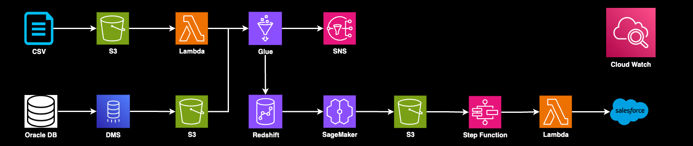
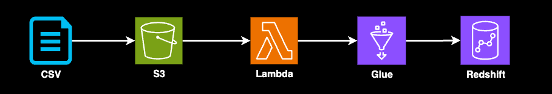
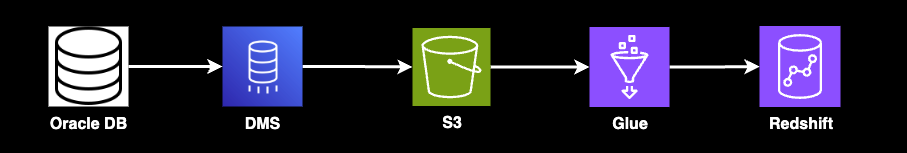
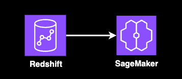
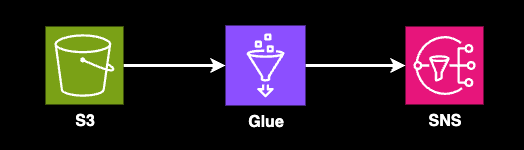
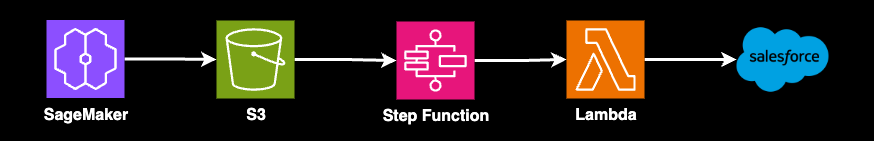

# AWS 自動化資料管道與機器學習平台

> [!IMPORTANT]
> **安全性警告**
>
> `config/database/oracle-connection.json` 檔案以及 `terraform/environments/` 目錄下的所有 `.tfvars` 檔案僅作為**範例**提供。
>
> **請勿**將包含真實憑證或敏感資訊的這些檔案提交到公開的儲存庫。強烈建議將這些檔案的路徑添加到您的 `.gitignore` 檔案中，以防止意外洩露。



本專案旨在建立一個全面、自動化且可擴展的雲端資料平台。其核心目標是整合來自不同來源 (CRM 系統的 CSV 檔案與 Oracle 資料庫) 的客戶資料，透過機器學習進行使用者分群，並將結果同步至 Salesforce 以支援精準行銷活動。

此平台採用 AWS 的最佳實踐，透過基礎設施即代碼 (IaC) 和 CI/CD 流程，實現了從資料攝取、處理、監控到部署的端到端自動化。

## ✨ 主要功能與特色

*   **自動化資料攝取與 ETL**:
    *   自動監聽 S3 中的 CSV 檔案，觸發 Lambda 與 Glue 進行處理並載入 Redshift。
    *   使用 AWS DMS 將 Oracle 資料庫持續遷移至 Redshift。

*   **動態結構演進 (Schema Evolution)**:
    *   資料管道能自動偵測來源資料中的新增欄位，並同步更新 Redshift 表格結構，無需手動介入。

*   **機器學習驅動的使用者分群**:
    *   利用 Amazon SageMaker 訓練與部署機器學習模型，對整合後的資料進行使用者分群。

*   **端到端的 Salesforce 整合**:
    *   透過 Step Functions 編排，將 SageMaker 的分析結果自動同步回 Salesforce，完成商業閉環。

*   **強大的監控與資料品質保證**:
    *   內建資料品質檢查規則，並透過 SNS 在偵測到異常時主動發送警報。
    *   提供集中的 CloudWatch Dashboard，用於監控所有管線狀態，並支援失敗任務的一鍵重試。

*   **安全與成本效益**:
    *   所有憑證均透過 AWS Secrets Manager 進行安全管理。
    *   透過 IaC (Terraform) 統一部署與管理所有雲端資源，並利用 S3 生命週期規則自動封存與刪除舊資料，以最佳化成本。

*   **CI/CD 與代碼審查**:
    *   整合 GitHub Actions，在程式碼合併前自動執行 `terraform plan`，並要求程式碼審查，確保生產環境的穩定性。

## 📋 目錄
1. [部署步驟](#-部署步驟)
2. [CSV to Redshift](#-csv-to-redshift)
3. [Oracle to Redshift](#️-oracle-to-redshift)
4. [Redshift > Sage Maker](#-redshift--sage-maker)
5. [AWS S3 > AWS Glue Job > AWS SNS](#-aws-s3--aws-glue-job--aws-sns)
6. [Sage Maker > AWS S3 > AWS Step Function > AWS Lambda > Salesforce](#-sage-maker--aws-s3--aws-step-function--aws-lambda--salesforce)
7. [Monitoring](#-monitoring)


## 🚀 部署步驟

要部署這個專案，請遵循以下步驟：

1.  **克隆儲存庫**：
    ```bash
    git clone <你的 GitHub 儲存庫 URL>
    cd aws-data-pipeline
    ```

2.  **配置 GitHub Secrets**： 在你的 GitHub 儲存庫中，導航到 `Settings` -> `Secrets and variables` -> `Actions` -> `New repository secret`。你需要添加以下秘密：

| Secret | 說明 |
| --- | --- |
| `AWS_ACCESS_KEY_ID` | 你的 AWS 存取金鑰 ID |
| `AWS_SECRET_ACCESS_KEY` | 你的 AWS 秘密存取金鑰 |
| `ORACLE_DB_HOST` | Oracle 資料庫主機名 |
| `ORACLE_DB_PORT` | Oracle 資料庫埠號 |
| `ORACLE_DB_SERVICE_NAME` | Oracle 資料庫服務名稱 |
| `ORACLE_DB_USER` | Oracle 資料庫使用者名稱 |
| `ORACLE_DB_PASSWORD` | Oracle 資料庫密碼 |
| `SALESFORCE_CLIENT_ID` | Salesforce 應用程式的 Client ID |
| `SALESFORCE_CLIENT_SECRET` | Salesforce 應用程式的 Client Secret |
| `SALESFORCE_USERNAME` | Salesforce 登入使用者名稱 |
| `SALESFORCE_PASSWORD` | Salesforce 登入密碼 |
| `SALESFORCE_SECURITY_TOKEN` | Salesforce 安全令牌 |

3.  **Terraform 後端配置**： 在 `terraform/main.tf` 中，已經配置了一個 S3 後端來儲存 Terraform 狀態。
    ```terraform
    terraform {
      backend "s3" {
        bucket         = "my-terraform-state-bucket-unique-name" # 請替換為你獨特的 S3 儲存桶名稱
        key            = "aws-data-pipeline/terraform.tfstate"
        region         = "us-east-1" # 請替換為你的 AWS 區域
        encrypt        = true
        dynamodb_table = "terraform-lock-table" # 請確保此 DynamoDB 表已存在且具有主鍵 'LockID'
      }
    }
    ```
    > **Note**: 在第一次運行 Terraform 之前，你需要手動創建這個 S3 儲存桶和 DynamoDB 表（用於狀態鎖定）。確保 S3 儲存桶名稱是全球唯一的。

4.  **更新 Terraform 變數檔案**： 檢查 `terraform/environments/` 目錄下的 `dev.tfvars`、`staging.tfvars` 和 `prod.tfvars` 檔案。根據你的環境需求，更新其中的變數值。

5.  **推送到 GitHub 觸發 CI/CD**： 一旦你配置了 GitHub Secrets 並更新了 `tfvars` 檔案，將你的程式碼推送到 GitHub 儲存庫的 `main` 或 `develop` 分支：
    ```bash
    git add .
    git commit -m "Initial project setup and CI/CD configuration"
    git push origin main # 或 develop
    ```
    這將觸發 `ci-cd.yml` 工作流程，自動部署你的 AWS 基礎設施和程式碼。

### 關鍵考量與後續步驟

1.  **佔位符替換**：
    - 在 `ci-cd.yml` 中，請務必將 `s3://your-lambda-code-bucket/` 和 `s3://your-glue-scripts-bucket/` 替換為你實際的 S3 儲存桶名稱。
    - 檢查所有 Terraform 檔案中的註釋，替換任何 `NOTE:` 或 `TODO:` 標記的佔位符。
2.  **IAM 權限精煉**：
    - 我們已經為 Lambda、Glue 和 DMS 配置了訪問 Secrets Manager 的權限。請務必審查所有 IAM 策略，並根據最小權限原則進行精煉。
3.  **Python 程式碼實現**：
    - 各個 Lambda 和 Glue 的 Python 腳本需要實現實際的業務邏輯。
4.  **SageMaker 模型開發**：
    - `sagemaker/notebooks/` 中的 Notebook 需要開發實際的機器學習模型訓練和使用者分群邏輯。
5.  **Step Functions 定義**：
    - `step-functions/` 中的 JSON 檔案需要根據你的業務邏輯進行詳細設計和實現。
6.  **監控與告警**：
    - `monitoring/cloudwatch/dashboards/main-dashboard.json`：需要根據你的需求自定義 CloudWatch 儀表板。
    - 確保 SNS 告警（`alert_email`）配置正確。

## 📄 CSV to Redshift


1.  當CSV 檔案被上傳到由這個 `terraform/modules/s3/main.tf` 定義的 S3 儲存桶中。檔案中的 `aws_s3_bucket_notification` 資源設定了事件通知。
2.  S3 的事件通知會觸發 `lambda_function.py` 的 `lambda_handler` 函數。它的唯一工作是從事件中讀取檔案路徑，然後呼叫 `glue.start_job_run()` 來啟動一個 Glue 任務。它完全不讀取 CSV 檔案的內容。
3.  這才是真正讀取和處理 CSV 檔案內容的地方。`csv-to-redshift.py` 被 Glue 服務執行，它會接收 Lambda 傳來的檔案路徑並且使用 Spark 的能力去 S3 讀取 CSV 檔案的完整內容最後將進行資料轉換、欄位映射等操作。
4.  處理完資料後，同一個 Glue 腳本會呼叫 `glueContext.write_dynamic_frame`，連接到由 `terraform/modules/redshift/main.tf` 定義的 Redshift 叢集，並將資料批量寫入指定的資料表中。

> ### 總結
>
> - **Lambda (`lambda_function.py`)**：像一個**總機**，接到電話 (S3 通知) 後，負責找到正確的人 (Glue 任務) 來處理這件事，並告知對方要去哪裡拿資料 (S3 路徑)。總機本人不處理資料。
> - **Glue (`csv-to-redshift.py`)**：像一個**資料處理中心**，接到總機的通知後，派出車隊 (Spark workers) 去 S3 把貨物 (CSV 檔案) 拿回來，在自己的工廠裡加工處理，最後再把成品送到 Redshift 倉庫。
> - **自動封存**：任何上傳到 `csv_bucket_name` 的新資料，會在 **30 天**後自動轉移到成本更低的 **S3 Glacier Instant Retrieval** 儲存層。
> - **自動刪除**：這些資料會在 **730 天 (兩年)** 後被自動永久刪除。

### 資料傳輸時的錯誤處理機制

1.  **Glue 任務腳本**：
    - 如果在處理某個 CSV 檔案的過程中發生任何錯誤 (例如，資料格式不符、無法寫入 Redshift 等)，腳本會：
        1.  捕捉到錯誤。
        2.  將導致錯誤的原始 CSV 檔案從它所在的位置，移動到同一個 S3 儲存桶下的 `error/` 目錄中。
        3.  終止任務並將其狀態標記為 `FAILED`。
    - **實現了「更新插入 (Upsert)」邏輯**：腳本會先將資料載入到一個臨時的階段性資料表。然後，它會根據您指定的主鍵 (預設為 `user_id`)，先刪除 Redshift 中已存在的舊紀錄，再插入新的紀錄。
    - **實現了「自動新增欄位」**：在載入資料前，腳本會先比對 CSV 檔案的欄位和 Redshift 資料表中現有的欄位。如果發現 CSV 中有新的欄位，它會自動執行 `ALTER TABLE ... ADD COLUMN ...` 命令。
2.  **新增了失敗警報規則**：
    - CloudWatch Event 規則會專門監控 Glue 任務的 `FAILED`、`TIMEOUT` 或 `STOPPED` 狀態。
    - 當有任務失敗時，這個規則會直接向您設定的 SNS 主題發送一則通知。

## 🗄️ Oracle to Redshift


1.  `terraform/modules/secrets-manager/main.tf`: 為了安全，資料庫的帳號和密碼等敏感資訊，會透過這個 Terraform 設定，預先存放在 AWS Secrets Manager 中。
2.  `config/database/oracle-connection.json`: 這個檔案理論上會用來存放連接 Oracle 資料庫所需的非敏感性設定。
3.  **AWS SCT**: 需要使用AWS SCT來分析並轉換Oracle 的 Schema為Redshift 相容的格式。
4.  **AWS DMS**: 負責實際的「搬運」工作。它可以執行一次性的完整載入 (Full Load)，也可以持續複製變動的資料 (Change Data Capture - CDC)。
5.  **S3 暫存區**: DMS 不會直接將資料寫入 Redshift，而是先存放在 S3的暫存區。
6.  **Glue Job**: DMS 將資料檔案寫入 S3 後，會觸發一個 Glue Job，最終將資料寫入Redshift。

### 如何管理及設定敏感資訊 (Secrets Manager)

> 正確的工作流程是：在 AWS Console 中手動建立 Secret，然後在 Terraform 中透過名稱 (ARN) 來引用它。Terraform 程式碼本身不應包含任何密碼。

### 使用 AWS SCT 從 Oracle 轉換結構 (Schema) 的完整步驟

**前置準備 (Prerequisites)**

1.  **網路存取**: 確保您執行 SCT 的電腦可以同時連線到您的 Oracle 資料庫和 AWS Redshift 叢集。
2.  **資料庫憑證**: 準備好連線 Oracle 和 Redshift 所需的所有資訊。
3.  **下載 AWS SCT**: 從 [官方下載頁面](https://aws.amazon.com/dms/schema-conversion-tool/) 下載並安裝。
4.  **下載 JDBC 驅動程式**: SCT 需要 Oracle 和 Redshift 的 JDBC 驅動程式 (`.jar` 檔案)。

---

**操作步驟**

1.  **設定 SCT 的驅動程式**: 在 `Settings` > `Global Settings` > `Drivers` 中設定驅動程式路徑。
2.  **建立新專案**: 選擇 `Oracle` 作為來源，`Amazon Redshift` 作為目標。
3.  **連線到 Oracle (來源)**: 填入連線資訊並測試連線。
4.  **連線到 Amazon Redshift (目標)**: 填入連線資訊並測試連線。
5.  **建立評估報告 (Assessment Report)**: 在來源 Schema 上按右鍵，選擇 `Create report` 來評估轉換複雜度。
6.  **轉換結構 (Convert Schema)**: 在來源 Schema 上按右鍵，選擇 `Convert schema`。
7.  **儲存 SQL 語法 (關鍵步驟)**: 在**右邊的面板** (Redshift) 中，在轉換好的 Schema 上按右鍵，選擇 `Save as SQL`，並將檔案儲存到 `scripts/sql/create_redshift_schema.sql`。

## 🧠 Redshift > Sage Maker


透過Redshift 儲存了User Data和CRM Data。Redshift ，經由Step Functions 進行調度 AWS Glue 和 SageMaker 來執行機器學習。

1.  **Step Functions**: 整個機器學習流程由 `step-functions/ml-pipeline.json` 進行統籌調度。
2.  **EventBridge (排程)**: `terraform/modules/stepfunctions/scheduling.tf` 設定了每天定時觸發的排程規則。
3.  **Glue (`ml-data-prep.py`)**: 從 Redshift 提取資料，進行清理、合併和特徵工程，最後存入 S3。
4.  **SageMaker (`train.py`)**: 從 S3 讀取資料，訓練使用者分群模型。
5.  **SageMaker (`inference.py`)**: 載入訓練好的模型，對新資料進行預測。
6.  **S3**: 儲存最終的預測結果。

## 🔍 AWS S3 > AWS Glue Job > AWS SNS


這個管線的目標是：當資料上傳到 S3 後，自動進行資料品質檢查。如果發現錯誤資料，會將其隔離並即時通知相關人員。

1.  **S3 Event**: 新檔案上傳事件會觸發一個 AWS Glue Job (`glue/jobs/data-quality-check.py`)。
2.  **Glue Job**: 讀取資料，並執行預定義的資料品質規則。可呼叫 `lambda/data-quality-checker/rules/quality_rules.py` 中的客製化規則。
3.  **S3 (錯誤資料)**: 如果發現問題，有問題的資料會被移動到 S3 的「錯誤資料」儲存區域。
4.  **SNS**: 同時，一個 SNS Topic 會被觸發，向相關人員發送即時通知。

### 如何新增規則

> 您只需要修改 `lambda/data-quality-checker/rules/quality_rules.py` 這一個檔案。

#### 新增 SQL 規則
1.  打開 `quality_rules.py` 檔案。
2.  在 `SQL_DATA_QUALITY_RULES` 字典中，新增一個鍵值對。
    - **Key**: 規則的唯一名稱。
    - **Value**: 一個包含 `query`, `error_type`, 和 `description` 的字典。
        - `query`: 撰寫 Spark SQL 查詢，**只選出不符合規則的壞資料**，查詢目標為 `temp_data`。

#### 新增 Python 規則
1.  打開 `quality_rules.py` 檔案。
2.  **定義新的規則函式**:
    - 建立一個新的 Python 函式，接收一個 `record` (字典) 作為參數。
    - 如果資料**符合**規則，回傳 `None`。
    - 如果資料**不符合**規則，回傳一個包含錯誤細節的字典。
3.  **註冊新的規則函式**:
    - 將您剛剛建立的函式名稱，加入到檔案下方的 `PYTHON_DATA_QUALITY_RULES` 串列 (list) 中。

## ☁️ Sage Maker > AWS S3 > AWS Step Function > AWS Lambda > Salesforce


1.  **S3 Event**: SageMaker完成訓練任務將資料儲存在S3 儲存桶之後，S3 會發出一個 `ObjectCreated` 事件，觸發 Step Functions 工作流程。
2.  **Step Functions**: 調用 Lambda `lambda/salesforce-integration/lambda_function.py`。
3.  **Lambda**: 從 S3 讀取機器學習結果，從 Secrets Manager 獲取 Salesforce 憑證，然後將結果上傳到 Salesforce。

### Salesforce 敏感資訊的設定與位置

Salesforce 的敏感資訊（如 API token, username, password 等）是安全地儲存在 **AWS Secrets Manager** 中的。

**設定方式：**

> **絕對不要將實際的敏感資訊直接寫在任何 `.tf` 檔案中並提交到 Git！**

您需要透過以下安全方式之一，在執行 Terraform 部署時提供 `salesforce_secret_json` 變數的值：

-   **CI/CD 環境變數/秘密 (推薦)**：在您的 GitHub Actions中，設定一個安全的環境變數或秘密。
-   **本地開發環境 (`terraform.tfvars` 檔案)**：
    - 在您的專案根目錄下，建立一個 `terraform.tfvars` 檔案。
    - **確保 `terraform.tfvars` 已經被加入到 `.gitignore` 中。**
    - 在此檔案中定義 `salesforce_secret_json` 變數。

## 📊 Monitoring
說明本專案中 AWS 資料管道的監控機制如何運作，以及如何進行相關的修改與客製化。

### 1. 監控機制概述

我們的資料管道監控核心是 **Amazon CloudWatch**，它負責收集來自各個 AWS 服務的指標 (Metrics)、日誌 (Logs) 和事件 (Events)。當偵測到異常時，CloudWatch 會觸發警報 (Alarms)，並透過 **Amazon SNS** 發送通知。

-   **集中式可視化**：所有關鍵指標和警報狀態都匯總到一個 **CloudWatch Dashboard**。
-   **即時通知**：透過 SNS，開發人員可以訂閱警報通知。
-   **日誌分析**：所有服務的詳細日誌都匯聚到 CloudWatch Logs，便於問題診斷。
-   **可重新執行性**：儀表板提供快速連結，引導開發人員到相關服務控制台，以便手動重新執行失敗的任務。

### 2. 監控機制運作方式 (技術細節與檔案結構)

本專案的監控基礎設施主要透過 **Terraform** 進行管理。

-   **CloudWatch 儀表板 (`monitoring/cloudwatch/dashboards/main-dashboard.json`)**: 定義了儀表板的佈局與圖表。
-   **CloudWatch 警報 (`monitoring/cloudwatch/alarms/*.tf`, `alerts/*.tf`)**: 定義在 Terraform `.tf` 檔案中的資源，用於監控特定指標並在達到預設閾值時觸發。
-   **SNS 通知 (`terraform/modules/sns/`)**: 負責建立和管理 SNS Topic。
-   **CloudWatch Logs**: 所有 AWS 服務的執行日誌都會發送到 CloudWatch Logs。
-   **資料品質監控 (`lambda/data-quality-checker/rules/quality_rules.py`)**: 定義了資料品質檢查的規則。